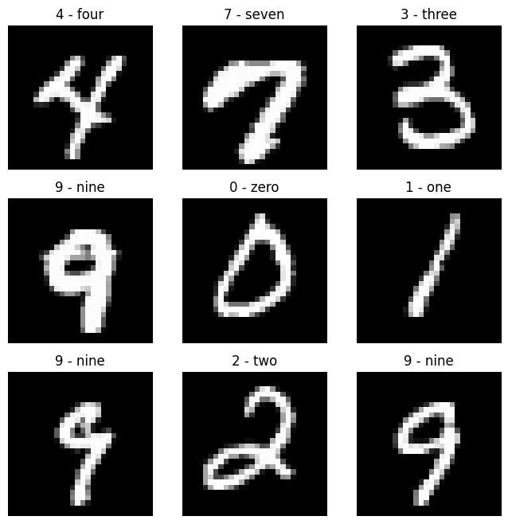
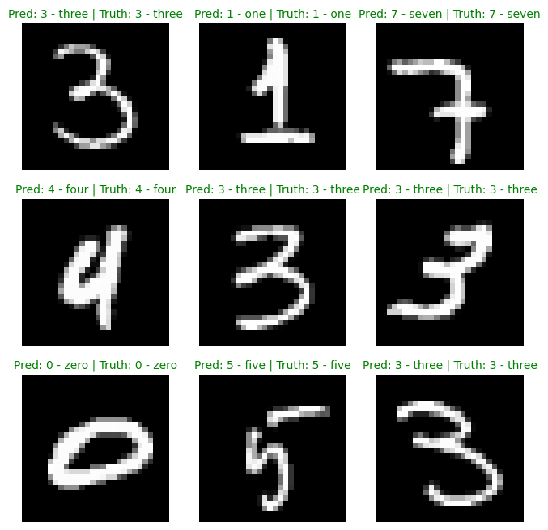
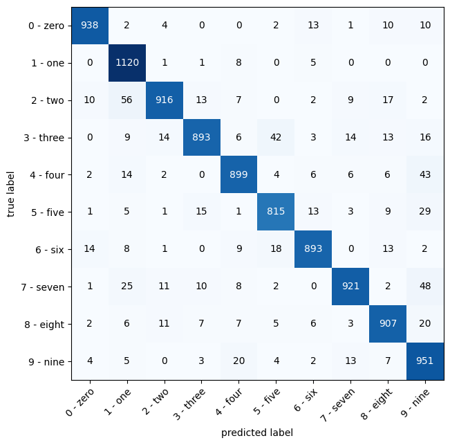

# Convolutional Neural Network (CNN) for MNIST Dataset

This project implements a Convolutional Neural Network (CNN) designed to recognize and classify handwritten digits from the MNIST dataset. 

The model's architecture is based on the TinyVGG CNN architecture. For more information, refer to: [CNN Explainer](https://poloclub.github.io/cnn-explainer/).

## Overview

The MNIST training dataset consists of 60,000 training images and 10,000 test images of handwritten digits (0-9). This CNN model is trained to accurately classify these digits.

## Example Images

### Sample Images from the Dataset

### Model Predictions

### Confusion Matrix

## Model Performance

After training with a batch size of 32 images and 5 epochs, the model achieved the following performance metrics:

- **Training Loss**: 0.04012
- **Training Accuracy**: 99%